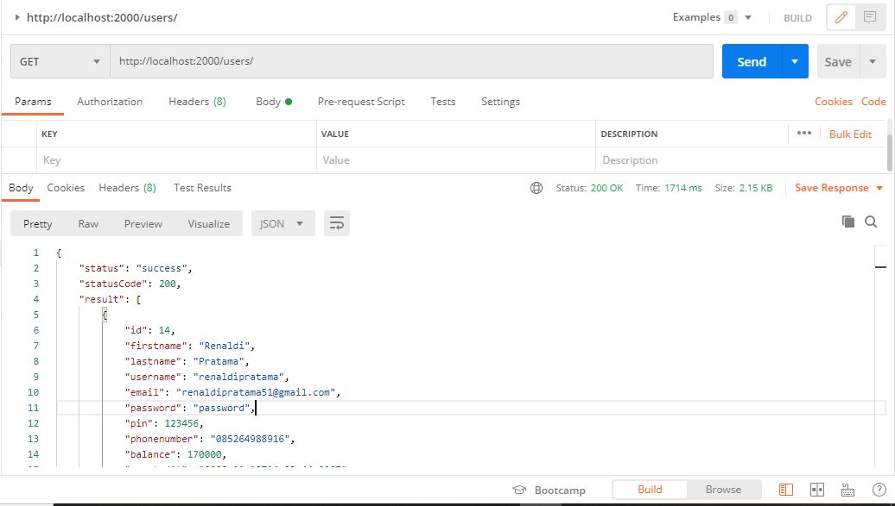
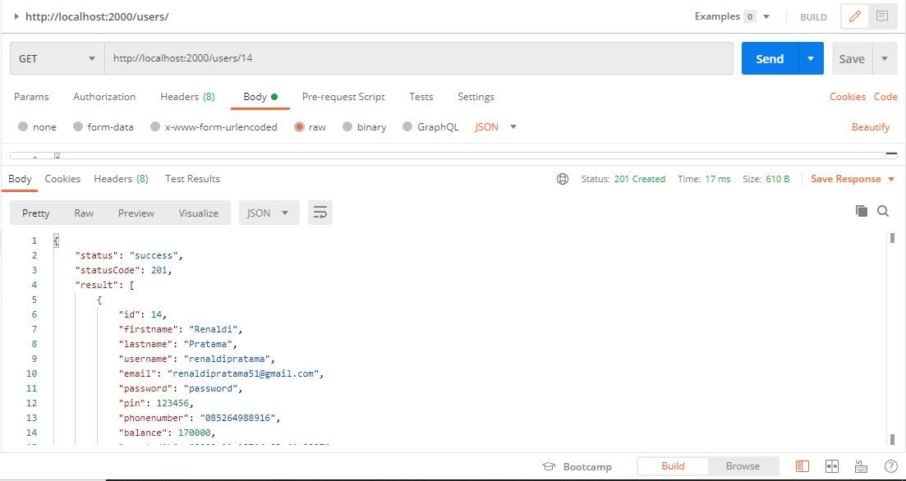
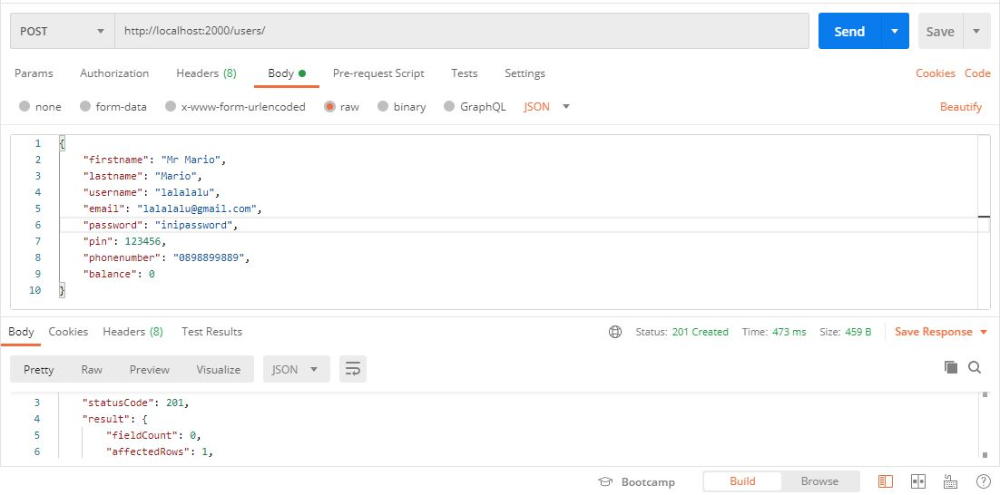
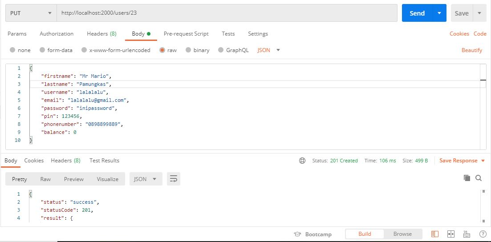
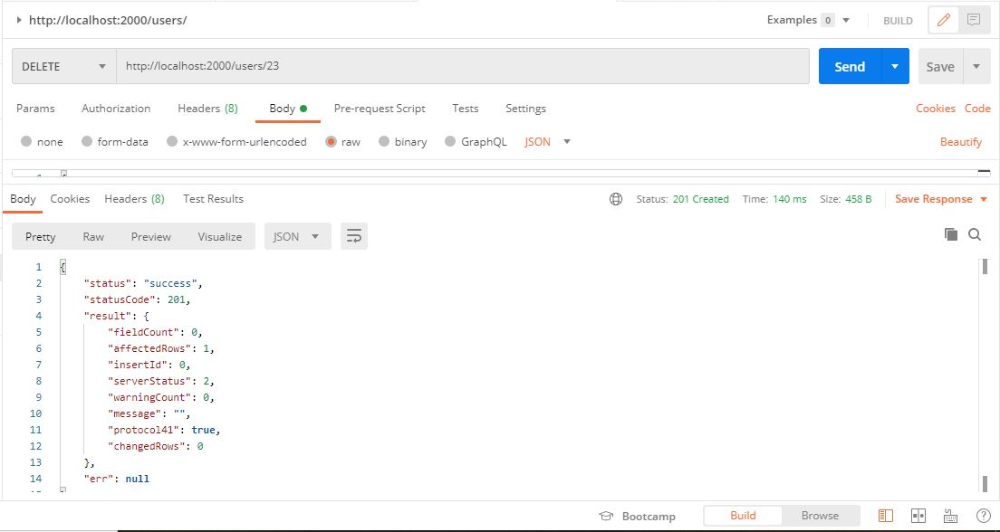

# Zwallet-BackEnd-NodeJS
This restfull api code backend repository using nodejs and expressjs.<br>
This application is built using nodejs and the expressjs framework which can run restfull api crud using the get, post, put and delete methods.

### Requirements
- NodeJs
- MySQL
- Postman
- Visual Studio Code
- Git

### Packages Used
- [Express js](https://www.npmjs.com/package/express)
- [Cors](https://www.npmjs.com/package/cors)
- [Nodemon](https://www.npmjs.com/package/nodemon)
- [Body-Parser](https://www.npmjs.com/package/body-parser)
- [Dotenv](https://www.npmjs.com/package/dotenv)
- [MySQL](https://www.npmjs.com/package/mysql)


### Instalation or Setup
```bash
git clone https://github.com/renaldipratama97/Zwallet-BackEnd-NodeJS.git
cd Zwallet-BackEnd-NodeJS
```
```bash
npm install
```

### Screenshoot
Below is an example of crud restfull api using postman<br>
      

### Author
- Github : [renaldipratama97](https://github.com/renaldipratama97)
- Instagram : [renaldipratama97](https://www.instagram.com/renaldipratama97/)
